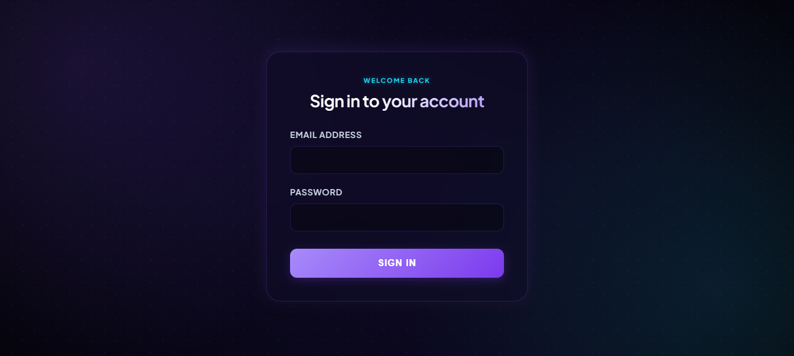
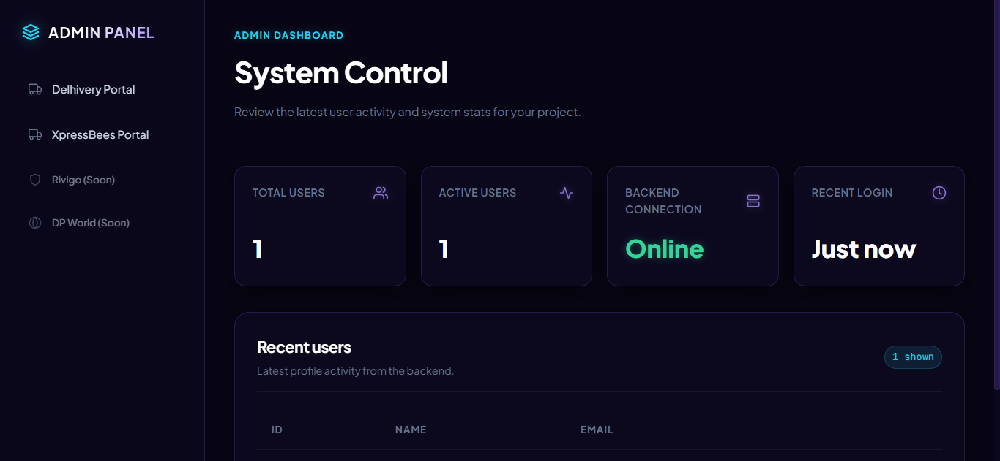
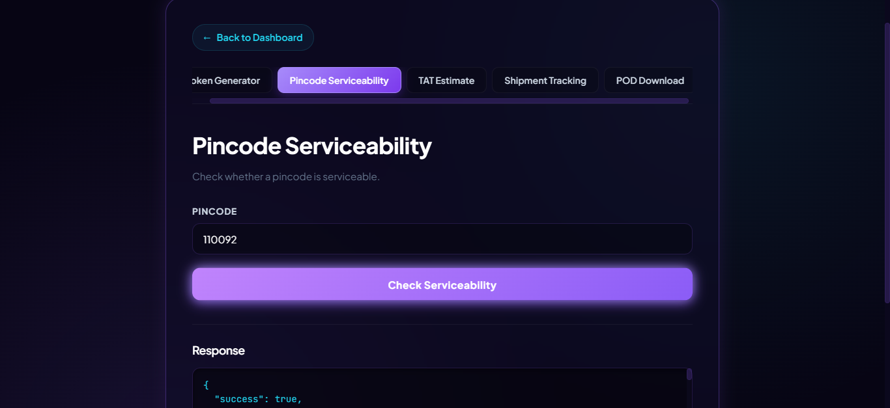
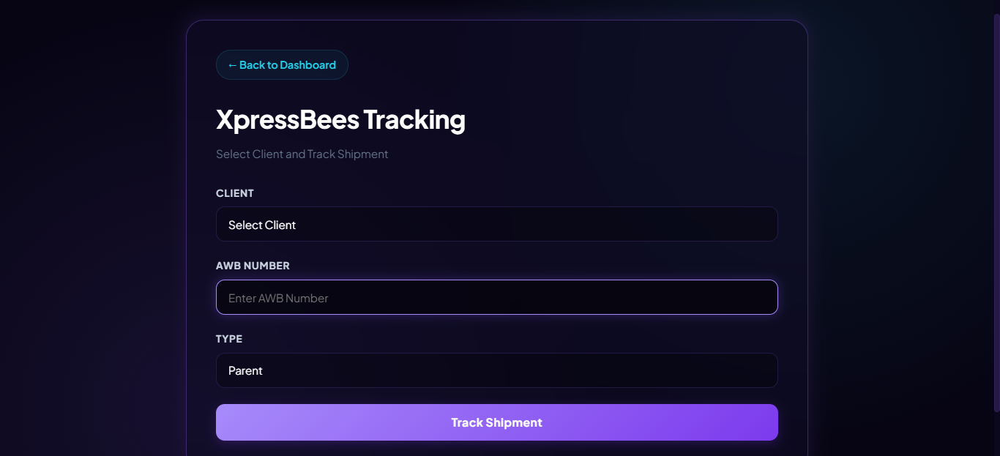

# Courier API Integration Platform

A full-stack courier management and API integration platform built with React, Node.js, Express.js, and Microsoft SQL Server.

The platform provides a centralized interface for integrating and interacting with third-party courier services, currently including Delhivery and XpressBees.

---

## 🚀 Features

### 🔐 Authentication
- User login system
- Backend authentication through SQL Server
- Protected application workflow after login

### 🚚 Delhivery Integration
- Delhivery API authentication
- JWT token generation
- Pincode serviceability
- TAT (Turn Around Time) estimation
- Shipment tracking
- POD (Proof of Delivery) download

### 🐝 XpressBees Integration
- Client-based configuration
- XpressBees shipment tracking
- AWB-based tracking
- Parent and Child shipment tracking types
- Client-specific XpressBees API keys stored securely in the database

### 🗄️ Database
- Microsoft SQL Server integration
- Client and credential management
- User authentication data
- Courier-specific configuration

### 🖥️ Admin Dashboard
- Centralized dashboard
- Courier network selection
- Separate interfaces for each courier integration
- API response visualization
- Client selection and shipment tracking

---

## 🛠️ Tech Stack

### Frontend
- React.js
- React Router
- Vite
- JavaScript
- CSS

### Backend
- Node.js
- Express.js
- Axios
- CORS

### Database
- Microsoft SQL Server
- `mssql` Node.js package

### APIs
- Delhivery APIs
- XpressBees APIs

---

## 🏗️ Architecture

```text
                    ┌──────────────────────┐
                    │      React App       │
                    │       (Vite)         │
                    └──────────┬───────────┘
                               │
                               │ HTTP Requests
                               ▼
                    ┌──────────────────────┐
                    │   Node.js / Express   │
                    │       Backend         │
                    └──────────┬───────────┘
                               │
                 ┌─────────────┴─────────────┐
                 │                           │
                 ▼                           ▼
        ┌─────────────────┐        ┌─────────────────┐
        │   SQL Server    │        │   Courier APIs  │
        │                 │        │                 │
        │ Users           │        │ Delhivery       │
        │ Clients         │        │ XpressBees      │
        │ API Keys        │        │                 │
        └─────────────────┘        └─────────────────┘
```

---

## 📸 Screenshots

### 🔐 Login Page



### 🖥️ Dashboard



### 🚚 Delhivery Integration



### 📦 Shipment Tracking



### 🐝 XpressBees Tracking

---

## 📁 Project Structure

```text
courier-api-integration-platform/
│
├── backend/
│   ├── db.js
│   ├── server.js
│   ├── package.json
│   └── .gitignore
│
├── my-react-app/
│   ├── src/
│   │   ├── admin/
│   │   │   ├── delhivery/
│   │   │   └── xpressbees/
│   │   ├── LoginPage.jsx
│   │   ├── Home.jsx
│   │   └── App.jsx
│   ├── package.json
│   └── vite.config.js
│
├── screenshots/
│   ├── login.png
│   ├── dashboard.png
│   ├── delhivery.png
│   ├── tracking.png
│   └── xpressbees.png
│
├── .gitignore
└── README.md
```

---

## 🔄 API Flow
### Delhivery

```text
React Frontend
      ↓
Express Backend
      ↓
Delhivery Authentication
      ↓
JWT Token
      ↓
Delhivery API
      ↓
Response
      ↓
React Dashboard
```

### XpressBees

```text
React Frontend
      ↓
Client Selection + AWB
      ↓
Express Backend
      ↓
SQL Server
      ↓
Retrieve Client XB Key
      ↓
XpressBees Tracking API
      ↓
Tracking Response
      ↓
React Dashboard
```
---

## 📌 Current Integrations

| Courier | Integration |
|---|---|
| Delhivery | Token Generation |
| Delhivery | Pincode Serviceability |
| Delhivery | TAT Estimation |
| Delhivery | Shipment Tracking |
| Delhivery | POD Download |
| XpressBees | Shipment Tracking |

---


## 👩‍💻 Development

This project was developed as a full-stack API integration application, including:

Frontend UI development
REST API integration
Backend route development
SQL Server integration
Authentication handling
API error handling
Courier-specific workflows
Client configuration management
---

## ⚠️ Disclaimer

This project integrates third-party courier APIs. Delhivery and XpressBees are third-party services and are not owned or created by this project.

API credentials, client information, and production shipment data are intentionally excluded from this repository.
---

## 📄 License

This project is intended for portfolio and educational purposes.
---
